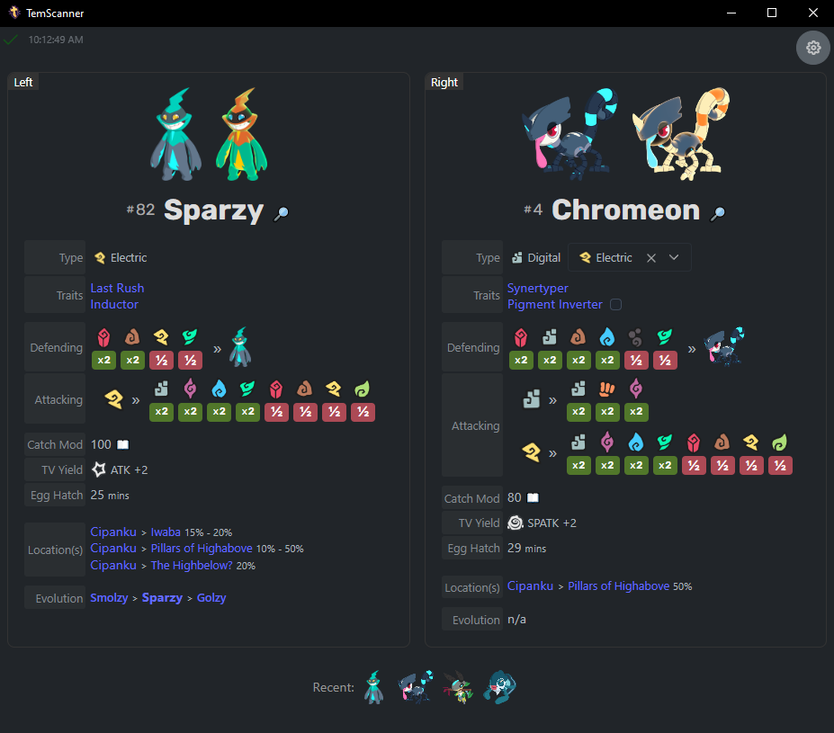
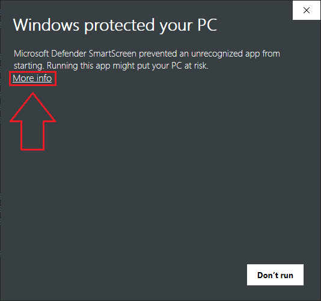
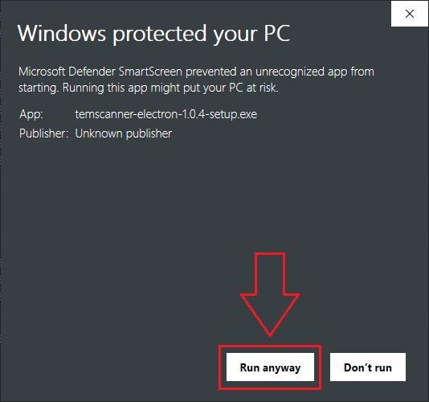
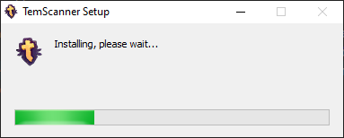

# TemScanner-Electron

Temtem UI assistant (local [Electron](https://www.electronjs.org/) web app) for automatically displaying Wiki/API data using [AutoHotkey v1](https://www.autohotkey.com/) and [OCR text recognition](https://learn.microsoft.com/en-us/uwp/api/windows.media.ocr?view=winrt-22621).



## Disclaimer

-   Does **NOT** read game memory
-   Does **NOT** automate any in-game functionality
-   Does **NOT** send any requests to game
-   Does **NOT** intercept any game data
-   Will **NOT** get you banned

## Details

The app will display a "Left" and "Right" panel, based on the active Tems on the enemy side of the battle. As shown in the screenshot above, you get the name, #, type information/modifiers, and more. Any embedded links lead to [Temtem Wiki](https://temtem.wiki.gg/wiki/Temtem_Wiki) pages for more information. Additionally, special tems like [Koish](https://temtem.wiki.gg/wiki/Koish) and [Chromeon](https://temtem.wiki.gg/wiki/Chromeon) allow you to manually set their secondary Type, and even specify their conditional traits for more accurate type bonuses/weaknesses.

When you defeat a Tem, the Left/Right panel will clear, except when you defeat the final/solo enemy Tem. This is to avoid clearing the panels when navigating sub-menus, or when the OCR fails detection for whatever reason.

At the top-right of the page there is an "Options" cog to toggle some settings for the UI. And in the top-left there is some debug information to help understand what the app is doing via OCR and Autohotkey data updates.

At the bottom of the page, there is a "Recent" row which shows up to 10 of the most recent Tems you've encountered, and does not show duplicates.

> If you have additional suggestions, feel free to [Open an Issue](https://github.com/Drumstix42/TemScanner-Electron/issues).

# How it works

The app loads the Temtem API data available at https://temtem-api.mael.tech/ to populate Temtem information within the app.

A sub-routine uses [AutoHotkey v1](https://www.autohotkey.com/) and the [Windows built-in OCR](https://learn.microsoft.com/en-us/uwp/api/windows.media.ocr?view=winrt-22621) to determine the Temtem name labels from the game window.

-   Autohotkey uses pixel detection to determine if the game is currently in battle and which Temtem is currently active on the enemy side. Currently it only supports 1440p and 1080p resolutions. More will likely be added with testing.
-   Autohotkey outputs the OCR text recognition result to a JSON file in the `<install-folder>/temscanner-electron/resources/app.asar.unpacked/resources/AutoHotkey` folder
    -   To reduce writes to the local disk, the JSON file is only written during combat
-   The Electron app reads the JSON file whenever it changes, and matches against the data populated from the API data noted above

# Application Usage

## How To Install

-   Download the ` temscanner-electron-*-setup.exe` file from the [latest release](https://github.com/Drumstix42/TemScanner-Electron/releases/latest) page.
-   Run the file to install the application.
    -   The installer will create a Desktop shortcut and Start Menu shortcut.
    -   The application will automatically start after installation.
    -   The application can be uninstalled normally as needed. See the [How To Uninstall](#how-to-uninstall) section below for more information.

### 📖 Smart Screen Warning

Since I don't have a [code signing certificate](https://learn.microsoft.com/en-us/windows-hardware/drivers/dashboard/code-signing-cert-manage) for [Electron builds](https://www.electronjs.org/docs/latest/tutorial/code-signing), Windows may warn you that the application is from an unknown publisher. You can safely ignore this warning and run the application.

| Step 1                                                              | Step 2                                                              |
| ------------------------------------------------------------------- | ------------------------------------------------------------------- |
|  |  |

> Please see the [Notes](#notes) section below for more information about the application, and how you can optionally build it yourself.

After confirming the application is safe to run (as needed), you can proceed with the installation:



## How To Uninstall

-   Navigate to `Add or remove programs` in Windows.
-   Find `TemScanner` in the list of installed applications.
-   Click on the row, and then click `Uninstall`.
-   _Alternatively_, you can manually navigate to the `temscanner-electron` folder (`<drive>:/Users/<username>/AppData/Local/Programs/temscanner-electron`) and run the `Uninstall temscanner-electron.exe` file.

# Notes

The OCR isn't perfect! But it works well in most scenarios.

-   A different 3rd party OCR engine that supports custom fonts would likely improve accuracy/simplify code. The moving battle camera can sometimes cause the OCR to struggle, but it will retry every 1 second. Otherwise, the OCR is fairly reliable as-is.
-   I've toyed with the idea of using Python instead of Authotkey, but I don't have development experience there.
-   The internal JavaScript logic has a dictionary of failed OCR patterns based on play testing, and otherwise matches Tem names at ~80% confidence to improve the app functionality.

> **Please don't blindly run `.exe` files provided from the internet when possible.** Take a look through the source code, and if comfortable with build tools, try building the app yourself instead of using the supplied EXE on the release page.

Note that the main app `.exe` file _is_ built here on Github, using the Electron Builder action. However, the Autohotkey script has been pre-compiled, mainly so the end user doesn't have to install AutoHotkey v1 to run the app...

The Autohotkey script _CAN_ be separately built if you have [AutoHotkey v1](https://www.autohotkey.com/) installed:

-   Navigate to the `<drive>:/Users/<username>/AppData/Local/Programs/temscanner-electron/resources/app.asar.unpacked/resources/AutoHotkey` folder
-   Backup/rename the existing `TemScanner.exe` file
-   Right-click the `TemScanner.ahk` file, and select `Compile Script` to build the EXE file (**Note**: AHK v1 must be installed with the `AHK Compiler` option selected)

## Known Issues

If you change your game resolution, you will likely need to restart the app for the OCR to work correctly.

# Project Development

### Recommended IDE Setup

-   [VSCode](https://code.visualstudio.com/) + [ESLint](https://marketplace.visualstudio.com/items?itemName=dbaeumer.vscode-eslint) + [Prettier](https://marketplace.visualstudio.com/items?itemName=esbenp.prettier-vscode)

### CLI Prerequisites

-   [Node.js](https://nodejs.org/en/) (v18.16.x)
-   [Yarn](https://yarnpkg.com/) (v1.22.x)

### Built using

-   [Electron](https://www.electronjs.org/)
-   [Vue 3](https://vuejs.org/)
-   [Vite](https://vitejs.dev/)
-   [electron-vite](https://evite.netlify.app/)
-   [AutoHotkey v1](https://www.autohotkey.com/)

### Install

```bash
$ yarn install
```

### Development

```bash
$ yarn dev
```

### Build

```bash
# For windows (the only currently targeted OS)
$ yarn build:win
```

# ✅ TODO's

-   [ ] Add support for more resolutions
-   [ ] Ability to search for Temtem by name within the app
-   [ ] Determine if game resolution has changed while app is running
-   [ ] Auto-updater for app?
